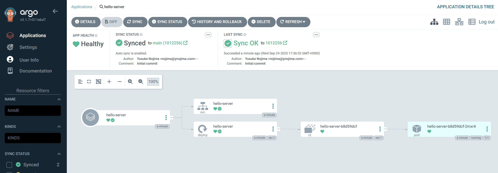

# Step2: Argo CD を使ってデプロイしてみる

## Argo CD用の Git リポジトリを作る

Step1 で作ったリポジトリとは別に、Argo CD のマニフェストを置くためのリポジトリを GitHub に作ってください。リポジトリ名は何でもいいですが、ここでは `hello-apps` を指定したものとして進めます。リポジトリのスコープは public にしておいてください。

## マニフェストをコピーする

以下のマニフェストを `hello-server.yaml` という名前で `hello-apps` リポジトリの直下に作ってください。

```yaml
apiVersion: argoproj.io/v1alpha1
kind: Application
metadata:
  name: hello-server
  # Application リソースは決められた namespace に作成しないといけない。
  namespace: argocd
  # Application を消した時にその Application が作成したリソースを削除する。
  finalizers:
  - resources-finalizer.argocd.argoproj.io
spec:
  project: default
  # source と path は自分のリポジトリのURLやパスに合わせて書き換えてください
  source:
    repoURL: https://github.com/YOUR_NAME/argocd-handson
    # "Revision" っていう名前だがブランチも指定できる。
    targetRevision: main
    # Kubernetes マニフェストを含むディレクトリを指定する。
    path: step1/kubernetes
  destination:
    server: https://kubernetes.default.svc
    # sync 先の namespace。 metadata のほうの namespace と混同しないように。
    namespace: hello-server
  syncPolicy:
    automated:
      # prune が true の場合、Git に定義されていないリソースを自動的に削除する。
      prune: true
      # selfHeal が true の場合、Git にコミットがないときでも定期的に sync を行う。
      selfHeal: true
```

この “Application” というリソースが Argo CD の中核となるリソースです。これは「どのソースコードを」「どの環境に」「どういうパラメータで」適用するか、という情報を含んだリソースです。”Application” という単語が汎用的すぎてちょっとわかりにくいですが、`kubectl apply` の `apply` を名詞化したものだと思っておくのがよいと思います。このリソースを使うことで `kubectl apply` を自動化することができます。

マニフェストをコピーしたら自分の環境に合わせて **repoURL, targetRevision, path を書き換えてください**。

- `repoURL` には、自分の hello-server のリポジトリの URL を指定します。
- `targetRevision` には、自分の hello-server のデフォルトブランチ (main または master) を指定します。
- `path` にはマニフェストを格納したディレクトリへのパスを指定します。このハンズオンの手順の通りにすすめていれば `kubernetes` を指定することになるでしょう。

## Argo CD を使ってデプロイする

```bash
kubectl create namespace hello-server
argocd app create -f hello-server.yaml
```

Argo CD の UI を見に行くと作成されたアプリケーションの様子が確認できます。




ついでにアクセスできるかも確認しておきましょう。

```bash
kubectl exec -it bastion -- curl -i http://hello-server.hello-server.svc.cluster.local
```

リクエストが成功したら step2 は完了です。お疲れ様でした！

